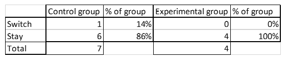
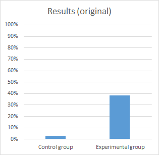
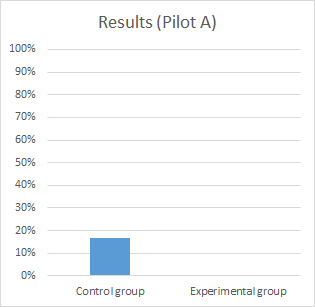
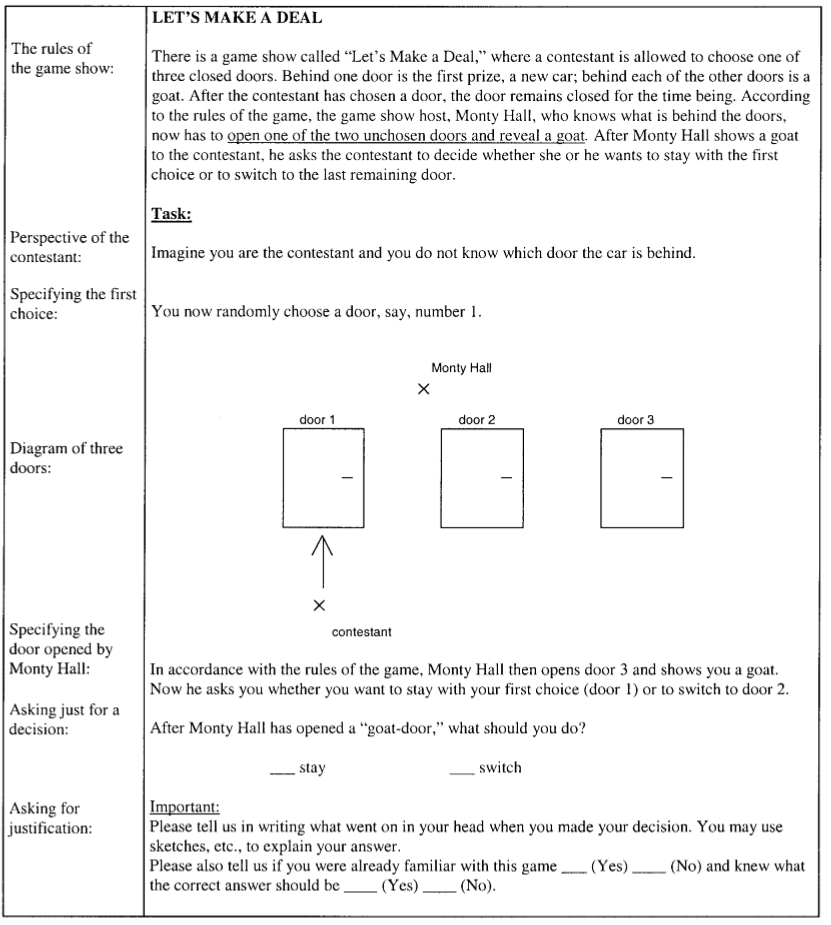
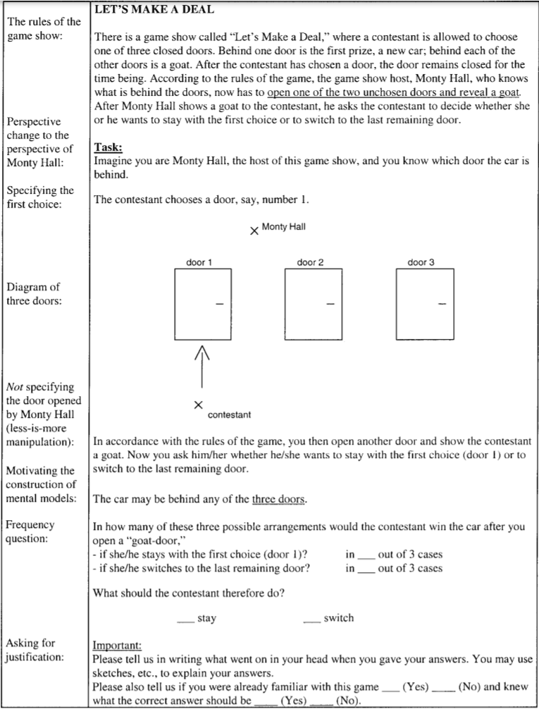

<!-- Replication reports should all use this template to standardize reporting across projects.  These reports will be public supplementary materials that accompany the summary report(s) of the aggregate results. -->

##Issues to be resolved before the final data collection

A power analysis suggests that the study requires a total of 38 participants evenly assigned to the two groups (19 per group).

However, two issues concerning sampling would need to be addressed before the final data collection:

- Prior problem familiarity: the MTurk HIT had a custom qualification to disqualify workers who had prior familiarity with the HIT. One of the four respondents indicated prior problem familiarity at the end of the survey but not the beginning. Perhaps this was an error and they were not familiar with the problem because they still gave an incorrect answer about what to do in the Monty Hall problem. Regardless, it is possible that some may lie on the qualification or not realise that they have encountered the problem until the end. I am not sure whether it would be good to over-sample and select the first 18 valid responses for analysis in each condition.

- Randomising and even number of participants: the randomising algorithm for pilot B assigned 3 participants to the control group and 1 to the experimental group. I had selected "evenly present elements", but this still did not prevent the problem. This might have been because Stefan Krauss (the original experimenter) completed the survey over night during pilot B (he didn't have time to look at it earlier). In any case, there's the risk that the randomising procedure might not assign exactly 19 units to each of the conditions. Again, over-sampling might be an appropriate strategy here.


##Links

Link to the GitHub repository: https://github.com/psych251/krauss2003

Link to the original paper: https://github.com/psych251/krauss2003/blob/master/original_paper/krauss2003.pdf

Link to the Qualtrics survey: https://stanforduniversity.qualtrics.com/jfe/form/SV_beA2tfPyXz83Otv

##Introduction

My PhD research focuses on the question of how humans should assign probabilities in various contexts, all with the hope to inform practical interventions to improve human reasoning. Studies show that the so-called "Monty Hall problem" is one context where humans frequently assign incorrect probabilities. This is an important context since it tests one's capacity to reason properly about likelihoods, a capacity which is central to reasoning about many topics in scientific, medical and everyday settings. Consequently, this paper hopes to partially replicate a promising procedure (experiment 1) for inculcating correct reasoning about the Monty Hall problem.

The procedure administers two questionnaires to participants in an experimental and a control condition. Participants in the control condition complete a questionnaire which asks for participants' responses to a standard version of the Monty Hall problem. Participants in the experimental condition complete a questionnaire about the "Guided intuition version" of the Monty Hall problem. Here, participants are guided to the correct solution to the Monty Hall problem with questions which encourage them: 1) to consider the problem from the fully informed perspective of Monty Hall, 2) to consider all possible arrangements of where the prize might be, 3) to count the frequencies with which a response strategy yields the optimal outcome and 4) to ignore the specifics of which particular door is opened by specifying merely that some door was opened and revealed a goat.


##Methods

Participants will be recruited via Amazon Mechanical Turk.

###Power Analysis


For two groups with proportions of 3% and 38%:

- 38 units are needed to achieve 80% power (with units evenly allocated between groups)

- 46 units are needed to achieve 90% power (with units evenly allocated between groups)

- 58 units are needed to achieve 95% power (with units evenly allocated between groups)


###Planned Sample


The original study featured three groups of participants recruited from various German universities. There were 67 participants in the control group and 34 participants in the experimental condition (bearing in mind that another 34 participants were also included in an alternative experimental group which is not the focus of replication for this study).

To ensure that the replication study is close to the original study, participants will be selected so as to inlude only people who have graduated from high school.

Some participants may have prior familiarity with the Monty Hall problem. Such participants will be omitted from the study with pre-test and post-test approaches. 

The pre-test approach will ask participants to indicate whether they are familiar with the Monty Hall problem prior to receiving the (modified) instructions in appendix A or B. The limitation with this approach is that it introduces a potential source of error into the study: participants may indicate that they are not familiar with the problem merely so that they can receive the monetary reward of completing the task on Mechanical Turk, and their prior familiarity may bias the results. In an attempt to control for this, participants will be asked a list of questions so that they are less likely to tell which question could prevent their participation on the task.

The post-test approach asks participants to indicate whether they are familiar with the Monty Hall through the instructions in appendix A or B. In particular, the last item on the instructions asks participants to "Please also tell us if you were already familiar with this game... and knew what the correct answer should be" 

The post-test approach can avoid the earlier source of bias.

A power analysis suggests that a sample of 38 people is necessary to detect the original effect with 80% power. A sample of 50 people has been planned to accommodate the possibility that some participants may have prior problem familiarity or may make errors which require them to be excluded from the final data analysis.


###Materials

Materials used for this study will include two versions of instructions: the control group instructions and the so-called "Guided Intuition instructions". These are reproduced in full in appendices A and B respectively. The guided intuition version incorporates the four features which Krauss and Wang believe facilitate good reasoning.

A minor modification will be made to the materials: namely, that the request for justification will omit the statement that "You may use sketches, etc., to explain your answer" as the online testing environment would not provide for that capacity.


###Procedure	

Participants will be randomly assigned to the control and the experimental condition, where they will be instructed to complete the tasks outlined in the respective appendices via Amazon Mechanical Turk.

Participants will be paid X amount for completion of the task, and they will have up to 2 hours to complete the task (although I expect responses to take about 5 minutes on average).


###Analysis Plan

Respondents who indicated prior familiarity will be excluded from the analysis.

The original study reports various statistical measures, but the one of primary importance concerns the difference in correct justifications between the groups. To clarify, a participant would give a correct justification for their answer to the Monty Hall problem if and only if they both provided the correct probability of switching doors (2/3) and this probability assignment was, in the words of the original authors, "comprehensibly derived" (11). 

Such assignments could be comprehensibly derived in two ways:

1.Specifying the probabilities via use of Bayes's theorem (7)
2.Counting the frequency with which the prize is one among various possible outcomes of the Monty Hall problem (two examples of which are provided on page 5)

The justifications will be extracted to a separate Excel file where justifications will be coded as correct or incorrect, all while being blind to which justifications are from the experimental or control conditions. The coding will then be transferred back to the main analysis dataframe. This may yield distinct proportions of correct justifications for the experimental and control conditions.

Following the original study's protocol, the difference between such proportions will be measured using Cohen's h and statistical significance will be calculated using Fisher's exact test.


###Differences from Original Study

There are several salient differences between this replication study and the original experiment:


Sample size: 

Pictorial justifications: In the original study, participants were allowed to visually represent their justifications for their responses in various formats, such as drawings of doors. For technical reasons, this study will not enable participants to draw such pictures, but it is expected that this should have a negligible impact on the proportion of correct justifications given or how they are coded.

Experimental setting: The original study brought students into the laboratory to complete their tasks, unlike the current study in which participants may respond through Amazon Mechanical Turk. Consequently, respondents may have been more likely to give more attention to the reasoning task since they are in an environment created for that sole purpose and the environment also includes the physical presence of an experimenter. In contrast, since Mechanical Turkers are left to their own devices, it is possible that the may rush through the task, thereby reducing the proportion of correct justifications or the clarity with which justifications are articulated. There is no definitive evidence about how great a risk this poses, but suspect it would be negligible, at least for the purposes of testing a substantial effect of some size. 

Coding of correct justifications: Unlike the previous study, a different coder (the present author) will code the justifications as correct or incorrect according to the criteria specified in the original paper. The results could be influenced by imperfect inter-rater reliability. However, it seems to me that the criteria for what qualifies as a correct justification are fairly straight-forward, comprehensible and uncontroversial, and so I suspect that the coders in the original and replication studies would likely have high or perfect agreement.


### Methods Addendum (Post Data Collection)

You can comment this section out prior to final report with data collection.

#### Actual Sample
  Sample size, demographics, data exclusions based on rules spelled out in analysis plan

#### Differences from pre-data collection methods plan
  Any differences from what was described as the original plan,


##Results


### Data preparation

Data preparation following the analysis plan.

	
```{r include=T}
# ###Data Preparation
# 
# #load data
# 
# dataedit <- read.csv("C:/Users/john-/krauss2003/data/dataedit.csv", comment.char="#")
# 
# #tidy data, if neccesary
# 
# #install packages with 
# 
# install.packages("tidyverse")
# library("tidyverse")
# 
# 
# # rename columns 
# 
# data_renamed = dataedit %>% rename(
#   experimental_switch = What.should.the.contestant.therefore.do.,
#   control_switch = After.Monty.Hall.has.opened.a..goat.door...what.should.you.do.,
#   familiarity = Please.also.tell.us.if.you.were.already.familiar.with.this.game.
# ) 
# 
# #remove missing values
# 
# data_gathered = data_renamed %>% gather(condition, switch, c(experimental_switch, control_switch)) %>%
#   filter(switch!="") %>%
#   filter(!is.na(switch))
# 
# #recode variables
# 
# data_recoded = data_gathered %>%
#   mutate(
#     condition = revalue(condition, c("experimental_switch"="experimental", "control_switch"="control"))
#   )
                               


```

### Confirmatory analysis


```{r include=T}
# ###Analysis
# 
# 
# #calculate and see propotions
# 
# table <- with(
#   data_recoded,
#   table(switch, condition))
# 
# 
# ###table 
# 
# #Cohen's h test and Fisher's exact test
# 
# install.packages("pwr")
# library(pwr)
# 
# h <- ES.h(
#   (table["switch", "control"]/ 
#      (table["switch", "control"]+ table["stay", "control"])),
#   (table["switch", "experimental"]/
#       (table["switch", "experimental"]+ table["stay", "experimental"]))
# )
#   
# test <-  fisher.test(as.matrix(table))
# 
# table
# h
# test

# ggplot(data = data_recoded, aes(x = condition)) + geom_bar(aes(fill = switch), position = "dodge") + labs(x = "Condition")


```







This definitively falsifies the original study's research claims.


###Exploratory analyses

Any follow-up analyses desired (not required).


## Discussion

### Summary of Replication Attempt

Open the discussion section with a paragraph summarizing the primary result from the confirmatory analysis and the assessment of whether it replicated, partially replicated, or failed to replicate the original result.  

### Commentary

Add open-ended commentary (if any) reflecting (a) insights from follow-up exploratory analysis, (b) assessment of the meaning of the replication (or not) - e.g., for a failure to replicate, are the differences between original and present study ones that definitely, plausibly, or are unlikely to have been moderators of the result, and (c) discussion of any objections or challenges raised by the current and original authors about the replication attempt.  None of these need to be long.


##Appendix A: Control group instructions




##Appendix B: Experimental group instructions


  
##Appendix C: Email to Authors
  
  
  